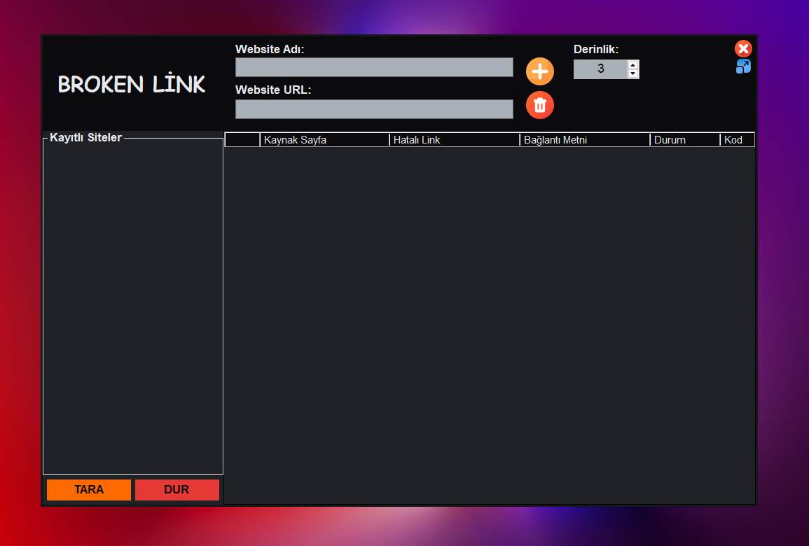
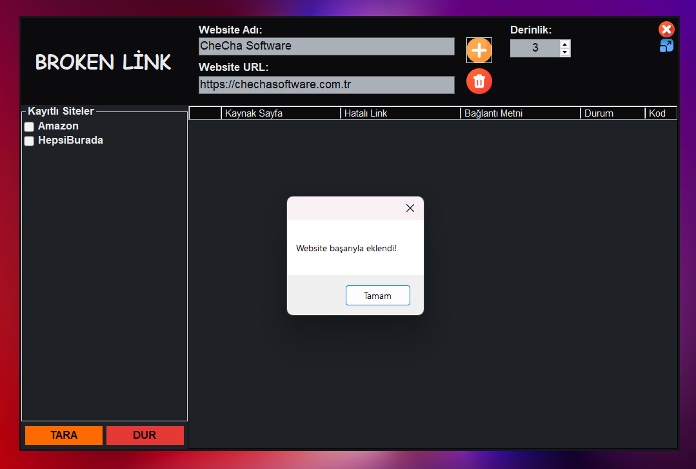
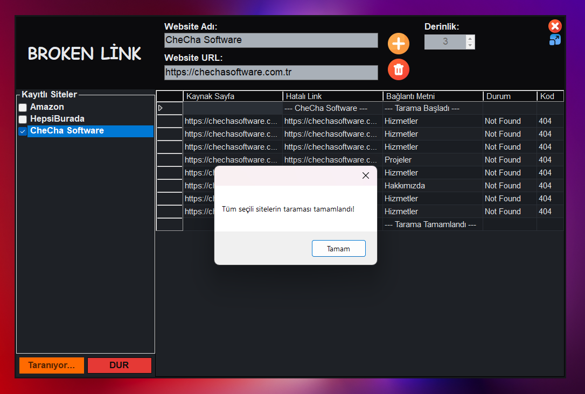

## Concurrent Broken Link Analyzer

Derinlik kontrollü tarama yapabilen, asenkron ve paralel işlem desteğine sahip bir web sitesi analiz uygulamasıdır.

Bu uygulama; performans, eşzamanlılık yönetimi ve kalıcı veri saklama odaklı tasarlanmış olup, tarama sırasında kullanıcı arayüzünün akıcı kalmasını hedefler.

---

## 🚀 Problem Tanımı

Büyük ve dinamik olarak büyüyen web sitelerinde zamanla şu problemler ortaya çıkar:

- Kırık iç veya dış bağlantılar
- 4xx / 5xx HTTP hata kodları
- Güncelliğini yitirmiş referanslar
- Site hiyerarşisinin derinlerinde gizli kalmış hatalı linkler

> Bu hataların manuel olarak tespit edilmesi zaman alıcı ve hata payı yüksek bir süreçtir.

> Bu uygulama, link analizini otomatikleştirerek detaylı ve yapılandırılmış bir raporlama sunar.

---

## 🔎 Uygulamanın Tespit Ettiği Bilgiler

Her hatalı link için sistem şu bilgileri raporlar:

- Kaynak sayfa URL’si (linkin bulunduğu sayfa)
- Hatalı link URL’si
- Anchor text bilgisi
- Hatanın açıklaması
- HTTP durum kodu

> Bu sayede kullanıcı, sorunlu bağlantıları hızlı ve net bir şekilde tespit edip düzeltebilir.

---

## 🧠 Temel Mühendislik Özellikleri

1️⃣ Kalıcı Site Yönetimi (Veritabanı Desteği)

- Hatanın açıklamasıKullanıcı taramak istediği siteleri kaydedebilir
- Hatanın açıklamasıTarama geçmişi saklanır
- Hatanın açıklamasıUygulama kapatılıp yeniden açıldığında veriler korunur
- Hatanın açıklamasıÇoklu site yönetimi için yapılandırılmış bir sistem sunar

2️⃣ Asenkron Tarama (Async/Await)

- Tarama sırasında kullanıcı arayüzü donmaz
- Uzun süren işlemler UI’yi bloklamaz
- Arka planda güvenli işlem yürütülür
- Kullanıcı deneyimi korunur

3️⃣ Derinlik Kontrollü Tarama Algoritması

- Kullanıcı tarafından belirlenen tarama derinliği
- Recursive link dolaşımı
- Sonsuz döngülerin engellenmesi
- Cycle detection mekanizması

> Bu yapı sayesinde site, kontrollü ve güvenli şekilde en uç linklere kadar analiz edilir.

4️⃣ Paralel Link İşleme

- Birden fazla link eşzamanlı işlenir
- Toplam tarama süresi azalır
- Büyük sitelerde performans artışı sağlar
- Aşırı yükü önlemek için kontrollü eşzamanlılık uygulanır

5️⃣ Çoklu Site Eşzamanlı Tarama

- Daha önce kaydedilen siteler seçilebilir
- Aynı anda birden fazla site taranabilir
- Toplu tarama desteği
- Kullanıcının manuel olarak her siteyi ayrı başlatmasına gerek kalmaz

> Bu sayede kullanıcı taramayı başlatıp başka işlerine odaklanabilir.

---

## 🏗 Sistem Mimarisi

Uygulama aşağıdaki katmanlardan oluşur:

- Link Ayrıştırma Katmanı
- Asenkron Tarama Motoru
- Paralel İşleme Modülü
- Hata Filtreleme Bileşeni
- Raporlama ve Kalıcı Veri Katmanı

> Mimari tasarımda ölçeklenebilirlik, performans ve kullanıcı deneyimi önceliklendirilmiştir.

---

## 📊 Teknik Odak Alanları

- Eşzamanlılık Tasarımı
- Async/Await Kullanımı
- Kontrollü Recursive Yapılar
- Paralel İşlem Mekanizmaları
- Kalıcı Veri Yönetimi
- Performans Optimizasyonu

---

## 📸 Screenshots

---
